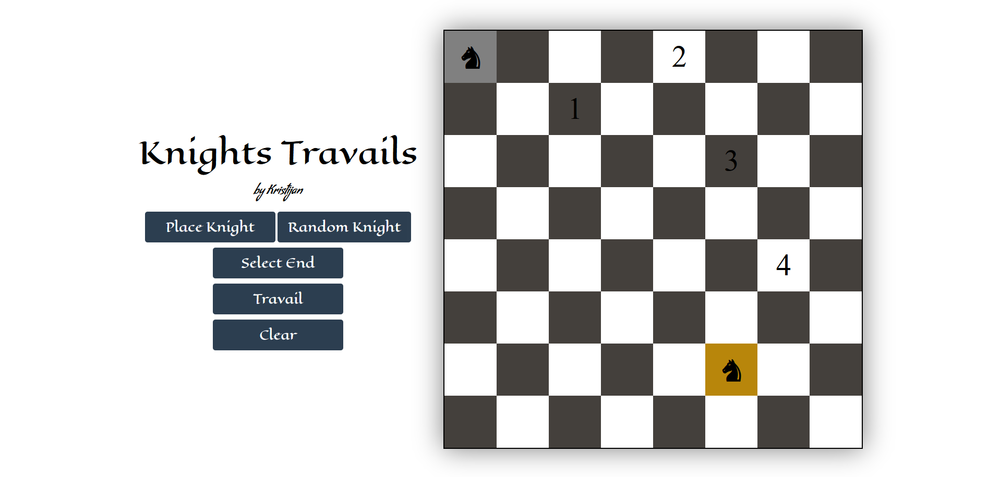

# Knights Travails - Odin

This is made as part of Odin Project by Kristijan Turić  
The Website Demo can be found at: [Knights Travails](https://kristijanturic.github.io/odin-knights-travails/)

1. Place a Knight or a Random Knight
2. Select End -> select the cell you want your knight to move to
3. Travail -> the knight will move and show the steps it took  
4. Clear -> Clears the chessboard

Have a try! [Try the demo](https://kristijanturic.github.io/odin-knights-travails/)

